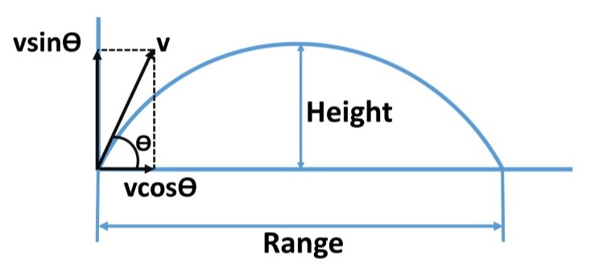
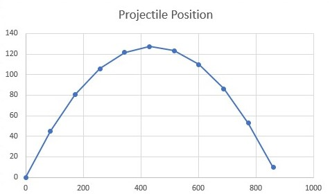

# HW13: Arrays & Projectile Motion

## Summary

You will write a program that takes the initial velocity and angle of a projectile being launched. The program should calculate the vertical and horizontal position for every second the object is in the air, the positions should be stored in arrays and then outputted to a CSV file.

<br/>

## Introduction to the Problem

This is a representation of what you program will be calculating. In the picture you can see a projectile being launched at an angle θ with initial velocity V.


>Note that the initial velocity is different from the vertical and horizontal velocities. You will need to use the formulas below to calculate the vertical and horizontal velocities.

<br/>

### Here are the formulas you will need for this assignment:

Flight time (Time in the air)  g is the acceleration due to gravity.  The value you should use for gravity is:


#### Flight time (Time in the air) 
 

#### Horizontal velocity (Vx)


#### Vertical velocity (Vy)


#### Displacement - Position at time (t)


#### Height - Position at time (t)


<br/><br/>

## Program Description

Your program should ask the user to enter the initial velocity, and the angle of the projectile. The program should calculate the time that the object would stay in the air using the flight time formula given, then calculate the horizontal and vertical position of the object at every second, storing the positions in arrays, and then outputting to a CSV file. 

### Sample output
```
Initial velocity(m/s): 100
Angle of departure(degrees): 30
File name: output
File created succesfully
t(s)    X(m)    Y(m)
0      0.00     0.00
1      86.60    45.09
2      173.21   80.38
3      259.81   105.85
4      346.41   121.52
5      433.01   127.38
6      519.62   123.42
7      606.22   109.66
8      692.82   86.08
9      779.42   52.69
10     866.03   9.50
```
> Your program should also output a csv file with the values for t, x and y.


<br/>

## Submission
* One java file named HW_Arrays.java 
* PDF, JPG, or PNG picture of the graph plotted

### Plotting the graph
In Excel, plot a graph using the csv file outputted, and take a screenshot of your graph. [Tutorial](https://www.got-it.ai/solutions/excel-chat/excel-tutorial/plot-x-vs-y/how-to-plot-x-vs-y-data-points-in-excel) 



<br/>

## Additional Hints

#### Some helpful libraries


```Java
  import java.lang.Math;
  import java.io.FileWriter;
  import java.io.File;
```

Math Library includes some helpful functions for your calculations. You may also use the FileWriter library to create and write on your csv file.
```Java 
Math.toRadians(angle); // takes angle in degrees and returns angle in radians
Math.cos(angle); // returns cosine of an angle
Math.sin(angle); // returns sine of an angle
Math.pow(n,2); // Square of a number n
```
> **Don't forget to convert your angles to radians**

<br/>

## About this Document
Course taught at the University of Washington Bothell. By Don Peter, Winter 2021-February 2022, written by Bruno Futino.
